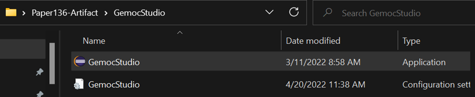
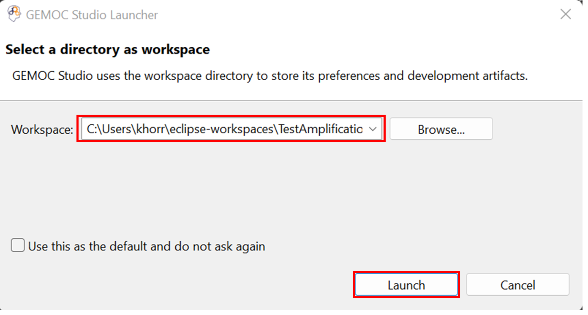

# Test4DSL: A Testing Framework for Executable DSLs
This repository provides a generic testing framework for Executable Domain-Specific Languages (xDSL).
It supports several features for testing executable models (conforming to xDSLs), including test case definition, execution, quality evaluation, debugging, fault localization, and improvement.
The framework is the output of PhD thesis of Faezeh Khorram.
The repository also contains the evaluation data of the thesis which can be used as samples to use the tool as well.

## Content Overview
- **testing_framework**: providing facilities for writing and executing TDL test cases on the executable models.
- **coverage_computation**: a generic framework for coverage computation of executable models. 

- **mutation_analysis**: offering mutation analysis for TDL test suites written for executable models.
This is the result of integrating our approach with [WODEL-Test](https://link.springer.com/article/10.1007/s10270-020-00827-0) which is a model-based framework for language-independent mutation testing. 

- **fault_localization**: a generic approach for fault localization of executable models. 

- **test_amplification**: an automated, generic test amplification approach for executable models.

- **Language_Workbench**: a set of example xDSLs from different domains.

- **Modeling_Workbench**: a set of models conforming to the provided xDSLs along with a set of TDL test cases written for each of them.

- **publications-data**: evaluation data of our publications.

## Setup
**Requirements**: 
- Operating System: Windows 10
- Java 16
- GEMOC Studio Version 3.5.0: https://gemoc.org/download.html
- TDL: https://tdl.etsi.org/eclipse/latest/

**NOTE**: There is a README file for each of the above-,mentioned tools in which we specify if there is some specific requirement for using them.

After downloading GEMOC Studio, unzip the folder and run it:
1.	Run `GemocStudio` application

    

        
    

    If it shows an error related to the incompatible java versions, you need to edit the `.ini` file (the `GemocSudio configuration settings` file as shown in the above picture under the `GemocStudio application`) and add the path of your installed java using `-vm` key right before the `-vmargs` key. For example,
    
        -vm
        C:/Program Files/Java/jdk-16.0.2/bin/javaw.exe
        -vmargs
        ...

2.	It asks for a workspace, either select an existing workspace or a new folder, then select `Launch`

    

3.	You need to install TDL using the provided update site. To do this, go to the `Help` menu and select `Install new Software`. Add the TDL update site and click on `Next`. Accept the license and follow the steps. At the end, it asks to restart the workspace.

    

        
    

    
    You may receive an error as "Cannot perform the operation" for two plugins: `converters to/from TDL` and `TDL graphical editor`. In this case, Eclipse will suggest skipping their installation and installing everything else. You can continue with this option as these two plugins are not necessary for our testing framework.

4.	An empty workspace will be shown. Here you should import the projects you want using `Import projects` option shown in the Project Explorer or by following: File -> Import -> Existing Projects into Workspace -> Select Root Directory (browse to the your intended directory) -> Select Folder -> Finish. The rest of the usage steps are explained for each tool separately in their specific README files.

## Acknowledgment
This work has received funding from the [EU H2020 research project Lowcomote](https://www.lowcomote.eu/), under the Marie Sk\l{}odowska Curie grant agreement No 813884.

