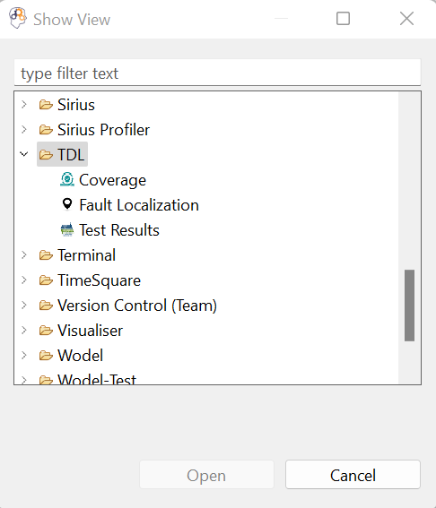

**Objective**: Coverage computation of domain-specific models.

## Content Overview

1. *org.imt.tdl.coverage*: the generic coverage computation tool. Considering a test suite for an executable model, it analyzes the model’s execution traces to extract its covered elements and compose the coverage matrix for the test suite. 
   
2. *org.imt.tdl.coverage.xtext*: a dedicated
metalanguage for defining xDSL-specific coverage rules whose concepts are presented in the following Figure. Given the abstract syntax of an xDSL in the form of a metamodel, a `DomainSpecificCoverage` can be defined for different Contexts each pointing to a metaclass of the xDSL’s abstract syntax. For each `Context`, several `Rules` can be defined and we are currently considering two families of rules:

    • *Inclusion rules*: a covered object, may induce that
    other objects are covered as well (see CoverageOf-
    Referenced and CoverageByContent rule types).

    • *Exclusion rules*: an object is ignored from coverage
    computation under a certain condition (see Ignore and
    ConditionalIgnore rule types).

    

## Usage

6. Our tool also provides a set of graphical views to display the results. You can open each one of them from the `Window` menu -> `Show View` -> `Other` -> `TDL`.
   

        
    

- *Coverage*
    

        
    
