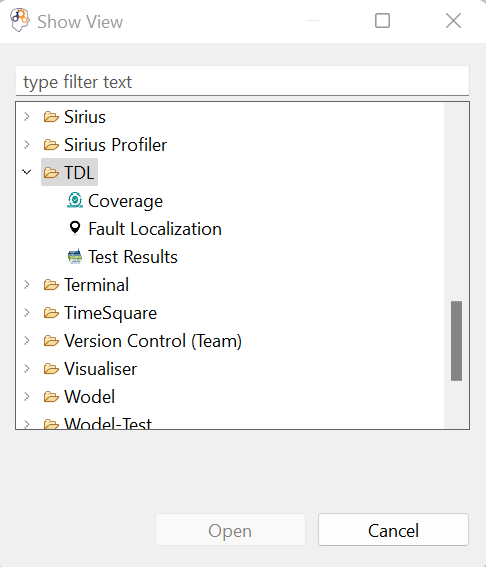
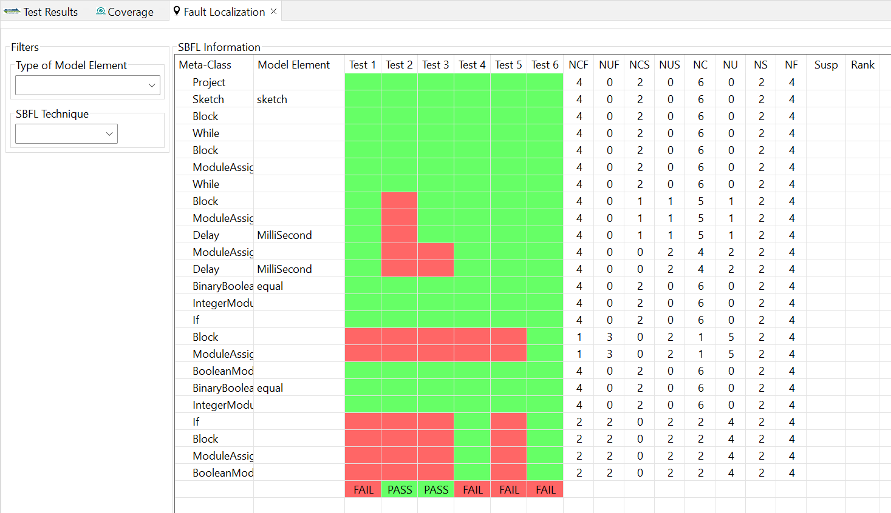
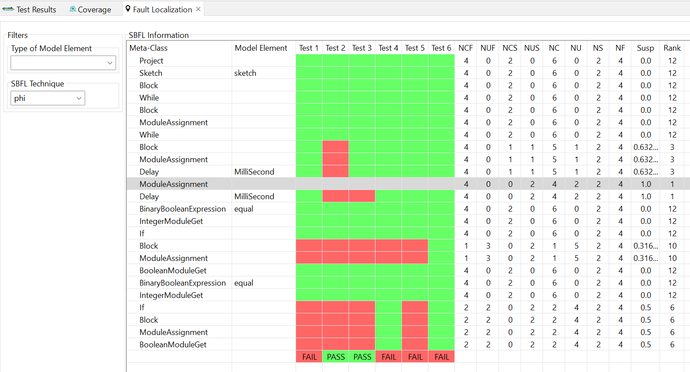

**Objective**: Fault localization of domain-specific models based on Spectrum-Based Fault Localization (SBFL) techniques.

## Content Overview

1. *org.imt.tdl.faultLocalization*: considering a TDL test suite of a model, it uses the execution result and
the coverage matrix of the test suite, generated by the `testing_framework` and the `coverage_computation` tools,  to calculate the suspicioussness-based ranking of the model’s elements using SBFL techniques.

## Usage

2. Our tool also provides a set of graphical views to display the results. You can open each one of them from the `Window` menu -> `Show View` -> `Other` -> `TDL`.
   

        
    

- *Fault Localization*: At first that no SBFL technique is selected, the `Susp` and `Rank` columns are empty.
  
    

        
    

    Once you select a technique from the list (e.g., here we selected `phi` technique), the suspiciousness score and the rank of each model element will be calculated and immediately shown in the view. Here based on `phi` technique, the score of the defected element is 1.0 and its rank is 1.
    

        
    

