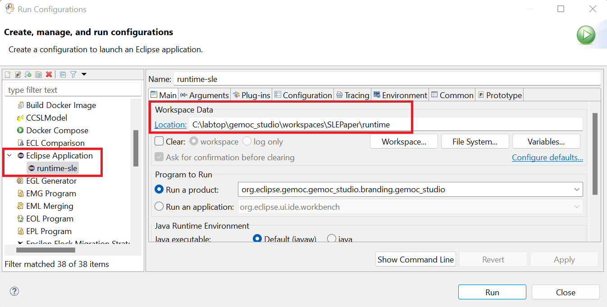

# From Coverage Computation to Fault Localization for Executable DSLs
This repository contains the tool and the evaluation data of our paper titled "From Coverage Computation to Fault Localization: A Generic Framework for Domain-Specific Languages", submitted to SLE 2022.

## Content Overview
1.	*Tool*: a set of eclipse plugins
- **coverage_Tool**: the coverage computation tool (`coverage.computation` plugin) and the textual syntax of the DSL-Specific Coverage metalanguage.
- **faultLocalization_Tool**: the fault localization tool (`faultLocalization` plugin).
- **testing_tool**: the plugins of the testing framework of Khorram et al. [[1]](https://faezeh-kh.github.io/publication/sosym22/) that we used for the definition and execution of the test cases on the executable models.
2.	*xDSLs*: the implementation of four Executable Domain-Specific Languages (xDSLs) of our case study, including:
    
    2.1. **xFSM** (taken from [GEMOC official samples](https://github.com/eclipse/gemoc-studio/tree/master/official_samples/K3FSM))

    2.2. **xArduino** (inspired from [Arduino Designer Project](https://github.com/mbats/arduino))

    2.3. **xPSSM** (taken from [examples of behavioral interface project](https://github.com/tetrabox/examples-behavioral-interface/tree/master/languages/statemachines))

    2.4. **xMiniJava** (inspired from [MiniJava project](https://www.cambridge.org/resources/052182060X) and taken from [MiniJava implementation in GEMOC](https://github.com/gemoc/minijava))
    
    The implementation of xDSLs involves several projects:

- <u>Abstract Syntax</u>: containing the `Ecore` metamodel of the xDSL and the java code generated from it using the `.genmodel` file.
- <u>Operational Semantics</u>: containing the interpreter of the xDSL implemented in `Xtend`.
- <u>Behavioral Interface</u>: containing a `.bi` file that is the interface of the xDSL and a java class that do the setups, so GEMOC engines can find and use the interface (Please note that only *xArduino* and *xPSSM* have such an interface)
- <u>Coverage Rules</u>: definition of a set of DSL-Specific coverage rules in a `.cov` file (Please note that the *xFSM* does not have any coverage rule)
- <u>Executable DSL</u>: containing a `.dsl` file that specifies the name of the xdsl, the path to the `.ecore` file, the list of execution rules of the operational semantics, the id of the behavioral interface project, and the path to the coverage rules.
- <u>Mutation Operators</u>: containing a `.mutator` file which includes the mutation operators defined for the xDSL using [WODEL language](https://gomezabajo.github.io/Wodel/)

    **NOTE**: Currently, we do not provide any graphical syntax for the xDSLs.

3.	*xModels&Tests*: the executable models conforming to each xDSL, a set of mutants generated for each of them (by applying the provided mutation operators using WODEL mutant generator), and a test project containing a test suite along with its execution result and its coverage report (under `result_coverage` directory).

    **NOTE**: There are also Excel files containing data related to the evaluation of the `fault localization` component.

1. *Data4CodeCover*: the equivalent java implementation of the xMiniJava models (taken from [here](https://www.cambridge.org/resources/052182060X/#programs)), and the JUnit tests corresponding to the xMiniJava tests. This data is used to compute the statement coverage of the JUnit tests with [CodeCover](http://codecover.org/index.html) tool.
   
2. An Excel file containing detailed data of the paper’s evaluation.

## Setup
**Requirements**: 
- *Operating System*: Windows 10
- Java 16
- GEMOC Studio Version 3.5.0: https://gemoc.org/download.html
- TDL: https://tdl.etsi.org/eclipse/latest/

After downloading GEMOC Studio, unzip the folder and run it:
1.	Run `GemocStudio` application

    

        
    

    If it shows an error related to the incompatible java versions, you need to edit the `.ini` file (the `GemocSudio configuration settings` file as shown in the above picture under the `GemocStudio application`) and add the path of your installed java using `-vm` key right before the `-vmargs` key. For example,
    
        -vm
        C:/Program Files/Java/jdk-16.0.2/bin/javaw.exe
        -vmargs
        ...

2.	It asks for a workspace, either select an existing workspace or a new folder, then select `Launch`

    

3.	You need to install TDL using the provided update site. To do this, go to the `Help` menu and select `Install new Software`. Add the TDL update site and click on `Next`. Accept the license and follow the steps. At the end, it asks to restart the workspace.

    

        
    

    
    You may receive an error as "Cannot perform the operation" for two plugins: `converters to/from TDL` and `TDL graphical editor`. In this case, Eclipse will suggest skipping their installation and installing everything else. You can continue with this option as these two plugins are not necessary for our tool.

4.	An empty workspace will be shown. Import the projects from the `Tool` directory using `Import projects` option shown in the `Project Explorer` or from `File` menu -> `Import` -> `Existing Projects into Workspace` -> `Select Root Directory` (browse to the *Tool* directory) -> `Select Folder` -> `Finish`.

    

  
**NOTE**: In our case study, we experimented our tool on four xDSLs. In this document, we will show how to run the experiment for the xArduino as it was also the running example of the paper. Nevertheless, you can follow the same steps for the other xDSLs.

## Usage
1.	Import the xArduino implementation from the `xDSLs/xArduino` directory in the same way described in the previous step. At the end, your project explorer should be as following picture:

    

2. To deploy the tool and the xArduino DSL, we should run this workspace using `Eclipse Application` run configuration. To do this, follow: `Run` -> `Run Configurations` -> choose `Eclipse Application` from the list of available configurations and double click to create an instance of it. You can optionally change the default name and the `workspace data location` of this configuration instance. Finally, press `Run` to open a new Eclipse instance.

    

        
    

    **Note**: The `workspace data location` defines the path to the workspace of the newly opened Eclipse instance.  

3. In the new Eclipse instance, import those projects from the `xModels&Tests` directory that you would like to try the tool for them. Here, we imported the projects related to the running example of the paper from the `xModels&Tests/XArduino-data` directory as follows:
- `Arduino.RunningExample_Model` project containing `runningExample_withDefect.model` that is an example Arduino xModel. It has a defect since the alarm is not ringing as expected when the sensor detects an obstacle (it is highlighted in red where alarm1 is mistakenly set to 1).
    
    

        
    

    **NOTE**: Please note that the model is an XMI file and there is no graphical model in the `Arduino.RunningExample_Model` project such as the one shown in the above figure. We use the above figure just to make it more understandable for this tutorial. 
    To open the model using Tree editor, right-click on the `runningExample_withDefect.model` file, `Open with` -> `Other` -> `Sample Reflective Ecore Model Editor` -> `OK`.

- `Arduino.RunningExample_Test` project containing:

    a)	`testSuite.tdlan2`: a test suite for the model comprising 6 test cases, one of those briefly drawn in the following Figure and completely shown in the next tool screenshot using TDL textual syntax.
    
    

        
    

    b)	`result_coverage/../testReport.xmi`: the result of test suite execution on the model.
    
    c)	`result_coverage/../testCoverage.xmi`: the result of coverage computation for the executed test suite.

    d) a copy of the executed test suite and a copy of the executed model under test for each executed test case. The elements of these copied models are referenced by the `testReport.xmi` and the `testCoverage.xmi` files. We copy them to make the report and the coverage files independent from the future changes of the test suite and the tested model.

    **NOTE**: The two files explained in (b) and (c) are indeed the output of our tool. We provided them here to be used during the evaluation of the tool, to check if the tool behaves as expected.

    

        
    

4. Run the test suite on the model by right clicking on the launcher file `/Arduino.RunningExample_Test/launcher/run-test.launch`-> `Run As` -> `run-test`.

    

        
    

    **NOTE**: We provided this launcher file for the sake of usage simplicity. If you had a new test suite and you would like to run it using the tool, the following steps must be followed:
    Right-click on your test suite (.tdlan2 file) -> `Run As` -> `Run Configurations...` -> select `Executable model with GEMOC Java engine` from the list of configurations on the left pane -> double click to create an instance of it -> `Browse` to locate your test suite file and set it as the `Model to execute` -> from the list of `Languages`, select `org.imt.xtdl.XTdl` that is the testing language of [[1]](https://faezeh-kh.github.io/publication/sosym22/) -> `Browse` to set the value of `Main method` and `Main model element path` (there will be only one option to select)

    

        
    

    From the `Engine Addons` tab, you can request the tool to save the test execution result and the test coverage measurements as XMI files.

    

        
    

    Finally, press `Run` to execute the test suite.

5.	When the test execution finishes, in the `Default MessagingSystem Console`, a message as *“Test suite execution has been finished successfully.”* must be shown followed by the coverage computation result. 
Also, you can see a new folder as "gemoc-gen" under `Arduino.RunningExample_Test` project which contains the execution result (i.e., the files described above in 3.b, 3.c, and 3.d steps).

    

        
    

6. Our tool also provides a set of graphical views to display the results. You can open each one of them from the `Window` menu -> `Show View` -> `Other` -> `TDL`.
   

        
    

- *Test Results*
    

        
    

- *Coverage*
    

        
    

- *Fault Localization*: At first that no SBFL technique is selected, the `Susp` and `Rank` columns are empty.
  
    

        
    

    Once you select a technique from the list (e.g., here we selected `phi` technique), the suspiciousness score and the rank of each model element will be calculated and immediately shown in the view. Here based on `phi` technique, the score of the defected element is 1.0 and its rank is 1.
    

        
    

