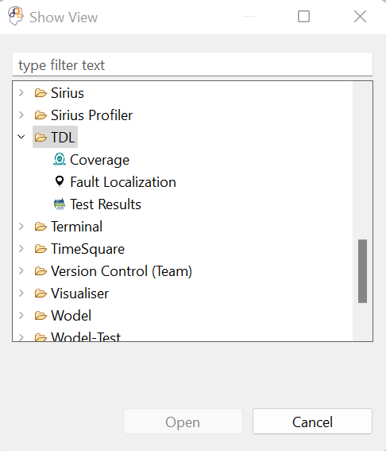
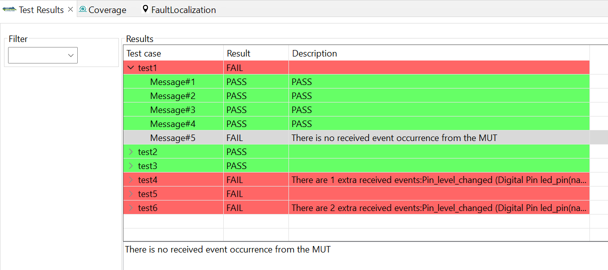

**Objective**: Providing facilities for writing and executing TDL test cases on executable models regardless of the xDSL used for the definition of the model.

## Content Overview
- *library_generator*: generating a domain-specific TDL library for a given xDSL.
- *test_engine*: an operational semantics for the TDL language, allowing the execution of TDL test cases on the executable models.
- *execution_engines*: configurations for connecting to external tools that are required for the execution of models and validation of OCL queries on models. 
- *test_result*: generating the test execution result, serializing it as an xmi file, and presenting it in a graphical view.
- *graphical_syntax*: an extended version of the [TDL standard graphical syntax](https://tdl.etsi.org/index.php/downloads).

## Setup
**Requirements**:
In addition to the general requirements, you need to install ATL transformation language to run the TDL library generator component of the framework:
- ATL transformation language Version 4.4.0 ([update site](http://download.eclipse.org/mmt/atl/updates/releases/4.4.0))

## Usage
To use XTDL for a given xDSL, the following steps have to be followed.
1. Import the plugins of this `testing_framework` directory. 

    

?? have to be checked from here
2. Import the intended xDSL into the workspace. For example, any of the xDSL in the *Language_Workbench* folder can be used.
3. Run as `Eclipse Application`
3. In the second workspace, define the models conforming to the input xDSL which are going to be tested. For example, the models in the *Modeling_Workbench* folder can be imported.
4. Define test cases for the models defined in the previous step. For example, the tests in the *Modeling_Workbench* folder can be imported. 
To write test cases from scratch, do the following steps:
- Create a new `Modeling project` for the definition of the test cases.
- Run the library generator using the GUI icons provided for it (it is in the toolbar and also in the menubar): It pop-ups a new window asking for a project and an xDSL to be chosen from a list. Choose the project you just created and the xDSL imported in the first workspace as the input xDSL. By clicking the `Finish` button, a set of TDL files (i.e., the TDL library specific to the input xDSL) will be defined under the selected project.
- Define the TDL test cases using the generated TDL files. To do so, you can define a new TDL file with the filename ending with `.tdlan2`, or you can use the generated `testSuite.tdlan2` file containing the required packages for writing test cases.
5. Run the test cases using the `Executable model with GEMOC Java engine` run configuration (For the sample test suites existing in the *Modeling_Workbench* folder, the required launch configurations are provided).
6. Our tool also provides a set of graphical views to display the results. You can open each one of them from the `Window` menu -> `Show View` -> `Other` -> `TDL`.
   

        
    

- *Test Results*
    

        
    
